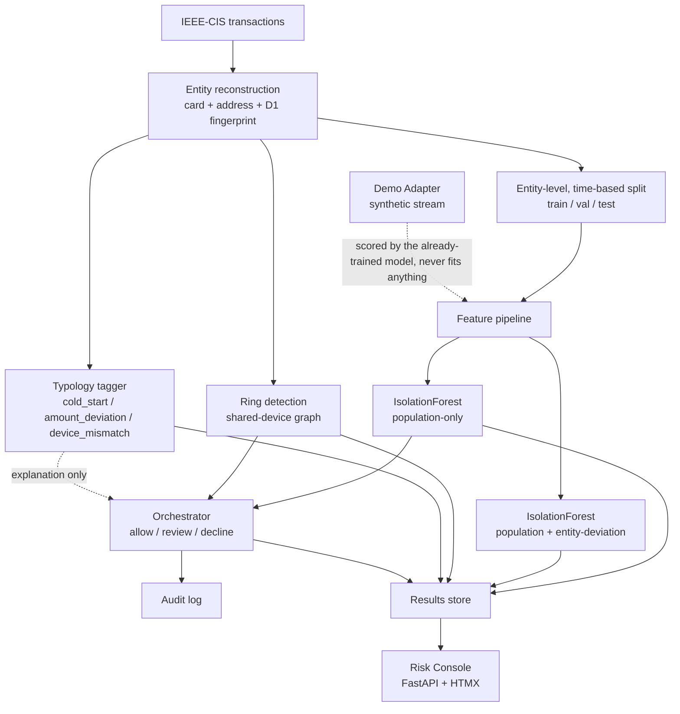

# Sentinel

**Behavioral fraud detection for payments.** Detection by deviation from learned account behavior, not by matching known rules. Explainable, gated, and viewable live in a console, not buried in a notebook.

---

## Why this exists

A flat "is this transaction fraud" classifier misses the cases that matter most: a stolen card used for an ordinary-looking amount, or a new account behaving identically to nine other "new" accounts sharing one device. Both look fine at the population level. Neither looks fine once you ask "is this normal for this entity specifically." This is a security technique (UEBA, User and Entity Behavior Analytics) applied to payments, and it's built to answer, at a glance, why any given transaction was flagged.

## The thesis in one line

*Learn what's normal for this account. Flag what isn't. Explain every flag. Measure the false-positive cost honestly.*

## Architecture



## Results

All numbers below are from the real, held-out IEEE-CIS test split (85,004 transactions), never the synthetic demo stream. Full methodology and the investigation behind every one of these numbers is in [`docs/LEARNING_LOG.md`](docs/LEARNING_LOG.md).

**The detector vs. all four required baselines, same metric (PR-AUC):**

| Method | PR-AUC |
|---|---|
| IsolationForest, population-only | **0.166** |
| IsolationForest, population + entity-deviation | 0.156 |
| Statistical baseline, population (\|z\|) | 0.055 |
| Rule baseline, entity (ratio to own prior max) | 0.047 |
| Rule baseline, population (raw amount) | 0.047 |
| Random / prior baseline | 0.045 |
| Statistical baseline, entity (\|z\| vs own history) | 0.045 |

The real detector beats every baseline by roughly 3x.

**The central question: does knowing an account's own history help? Honestly, no.** Entity-deviation does not improve PR-AUC over population-only, confirmed even when restricted to the 35% of transactions that actually have any entity history at all. Root-caused, not hand-waved: 42% of all fraud in this dataset happens on an account's *very first* transaction, where there is no history to deviate from by construction, and even where history exists, it's thin (median 2 prior transactions, 41% of those have exactly 1, not enough to compute a standard deviation from). Three independent lines of evidence point the same way. See `docs/ADR_LOG.md` (ADR-0007) for what this changed about the design.

**Ring detection works, clearly.** 70 credible clusters found (shared-device fingerprint, size *and* fraud-rate-elevation validated, not size alone, see the Learning Log for the bug that taught us why both matter). The strongest: **12 accounts sharing one device, 100% fraud rate**, against a 4.6% baseline.

**The gated auto-responder** evaluated all 85,004 test transactions, every one producing an audit record, including every refusal to act: 82,745 allowed, 1,874 declined autonomously, 385 routed to human review. Decision logic uses the population score plus ring membership, not the (proven not to help) entity-deviation score, see ADR-0007.

## Running it yourself

```bash
python -m venv .venv
.venv/Scripts/activate        # or source .venv/bin/activate on macOS/Linux
pip install -r requirements.txt
```

Download [IEEE-CIS Fraud Detection](https://www.kaggle.com/competitions/ieee-fraud-detection) from Kaggle, and place `train_transaction.csv` and `train_identity.csv` in `data/raw/` (gitignored, not included, see the dataset's own license).

Then, in order:

```bash
python scripts/fit_pipeline.py          # fits once, persists the feature pipeline + models
python scripts/run_baselines.py         # the four mandatory baselines
python scripts/run_full_comparison.py   # the central lift check, all methods, one metric
python scripts/run_ring_detection.py    # ring detection on the benchmark test split
python scripts/run_auto_responder.py    # the gated auto-responder + audit trail
python scripts/run_demo.py              # the synthetic demo stream, injected ring included
uvicorn console.app:app --reload        # the Risk Console, at http://127.0.0.1:8000
```

Every script prints its own numbers and writes to `results/` (gitignored, regenerated by running the scripts, not committed).

## Portfolio site

`web/` is a separate, static, Vercel-deployable showcase, a case-study landing page plus an interactive mini-console backed by the real result data (not live, baked in at build time). See [`web/README.md`](web/README.md).

## Documentation

| Doc | What it covers |
|---|---|
| [PRD](docs/01_PRD.md) | Problem, users, success metrics, scope & non-goals |
| [Architecture](docs/02_ARCHITECTURE.md) | Components, the `Detection` contract, tech stack |
| [Data & Evaluation](docs/03_DATA_AND_EVALUATION.md) | Dataset, entity reconstruction, baselines, metrics |
| [Technical Design Specs](docs/04_TECHNICAL_DESIGN_SPECS.md) | Per-subsystem interfaces and logic |
| [Roadmap](docs/05_ROADMAP.md) | Day-by-day delivery plan (kept as a historical record, see its Status note) |
| [Risk Console & Demo Layer](docs/06_FRONTEND_AND_DEMO.md) | The five console features, and the demo/benchmark separation |
| [ADRs](docs/ADR_LOG.md) | Why the key decisions were made, including the ones made after the results came in |
| [Learning Log](docs/LEARNING_LOG.md) | Running, raw notebook of concepts learned and bugs caught while building |

## Subsystems

1. **Ingestion & Entity Reconstruction:** normalizes transactions, derives a proxy account identity
2. **Detection Engine:** population-level and per-entity behavioral deviation scoring
3. **Typology Tagging:** descriptive, unscored labels (device mismatch, amount deviation, cold start)
4. **Ring Detection:** shared-fingerprint clustering across entities
5. **Gated Auto-Responder:** allow / review / decline, with a complete audit trail
6. **Risk Console:** detection feed, explain panel, metrics view, ring viewer, audit trail
7. **Demo Layer:** a realistic, payment-gateway-shaped synthetic stream, always visually separated from scored results

## Design principles

- The `Detection` schema is the contract between components.
- No result exists without a config that regenerates it.
- Baselines before cleverness, at both the population and entity level.
- Entity is the axis: every score means "how unusual for the entity it belongs to," not just "how unusual in general."
- Explainable, bounded, gated: no detection without a reason, no automated action without an audit record, including refusals.
- The demo is never the evaluation. The scored numbers come from one place, always.
- A negative result, honestly measured and fully explained, is worth more than a flattering one that isn't.

## Status

All eight build phases complete: entity reconstruction, baselines, the central detector, ring detection, the gated auto-responder, the Risk Console, the demo layer, and final polish (this README, the architecture diagram, the portfolio frontend). See [`docs/05_ROADMAP.md`](docs/05_ROADMAP.md) for the full history, including a complete rebuild of the entity fingerprint and evaluation split partway through, once a sharper approach became clear.
